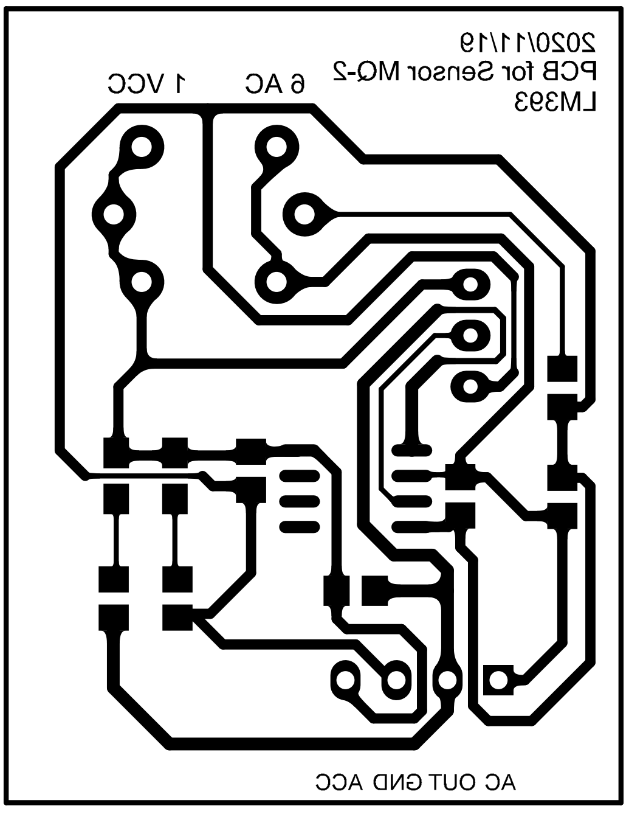

# About

本项目是用于感测技术大作业的一部分，传感器模块PCB使用[Altium Designer 18](https://www.altium.com/altium-designer/)设计绘制，MQ-2传感器物理封装数据参考与[这里](https://atta.szlcsc.com/upload/public/pdf/source/20180502/C99296_6F0BA5D7AA10C610B74ABFD8A5ECF346.pdf)。模块采用[Ti的LM393双路差分比较器](https://www.ti.com/product/LM393)驱动。

## 传感器模块原理图如下：

## 传感器模块PCB图如下：

## PCB打印输出设置如下：

## PCB图纸如下：

### PCB图纸的Pdf文件为：[PCB_MQ-2_Mirror.pdf ](https://github.com/bronya5th/PCB_MQ-2_Mod/blob/master/PCB_MQ-2_Mirror.pdf)

### MQ-2物理封装文件为：[MQ-2.PcbLib](https://github.com/bronya5th/PCB_MQ-2_Mod/blob/master/MQ-2.PcbLib)

